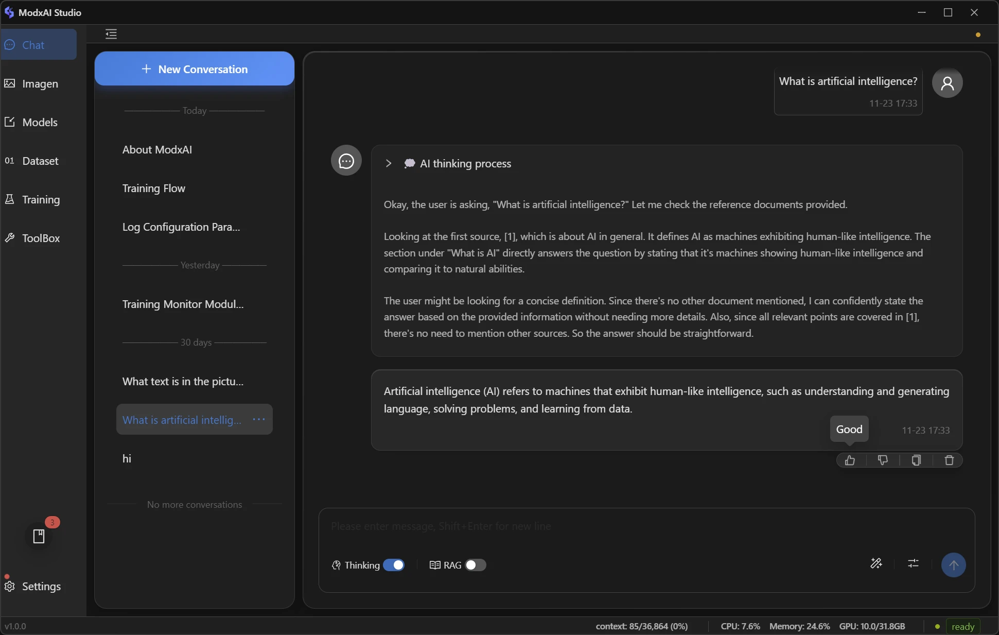
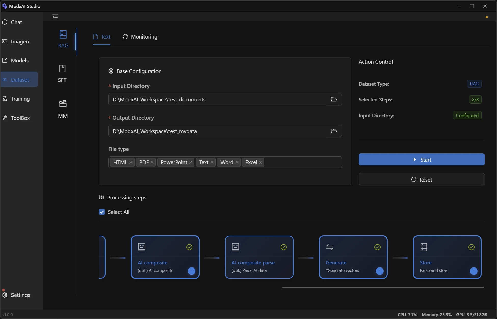
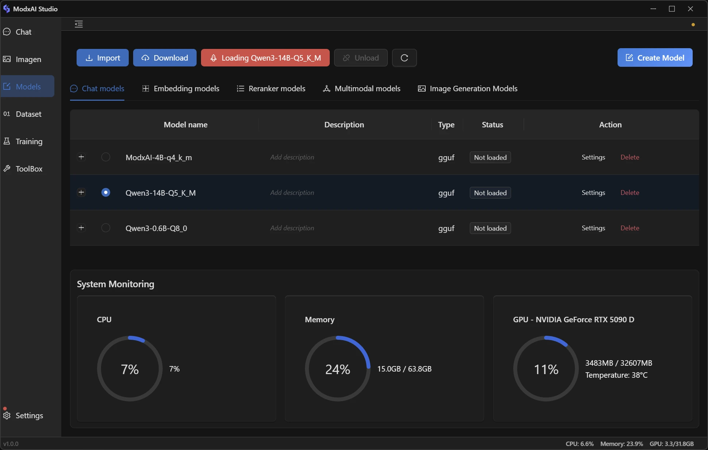
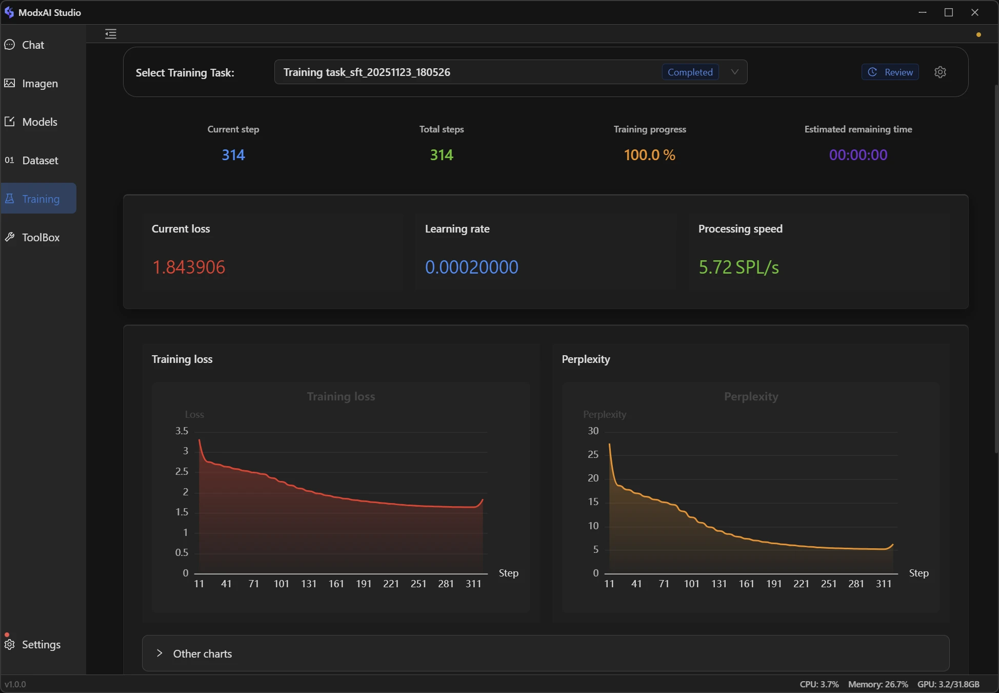

[English](#modxai-studio) | [简体中文](#modxai-studio-zh)

# ModxAI Studio

> Local-first AI studio for chat, models, data, training and SD — with one-click environments.

**ModxAI Studio** is a desktop application that turns a single machine into a local AI workstation. It bundles model management, AI chat, data processing, training, and Stable Diffusion–based image/video generation into one unified, GUI-driven tool, without requiring users to hand‑craft Python environments or shell scripts.

> Note: ModxAI Studio is planned for public release in **December 2025**. This repository currently hosts the **documentation site only**.

Official site: [https://www.modxai.net/en](https://www.modxai.net/en) · 中文官网: [https://www.modxai.net/zh](https://www.modxai.net/zh)

---

## Quick Preview

Below are some core modules of ModxAI Studio (images from `assets/images`):

| AI Chat | Datasets & RAG | Model Library |
| ------ | -------------- | ------------- |
|  |  |  |

| SD Image/Video | Training Pipeline | Environment Setup |
| -------------- | ---------------- | ----------------- |
|  |  |  |

---

## Key Features

- **AI Chat (Text & Multimodal)**  
	Local LLM chat powered by `llama.cpp`, with support for text Q&A, code generation, multimodal (image+text) queries, system prompts, RAG retrieval, per‑message operations, and high‑quality conversation collection for later training.

- **Model Library**  
	Unified management for chat, multimodal, embedding, rerank and SD models. Supports one‑click download from Hugging Face / ModelScope, local import of GGUF/SafeTensors, LoRA adapters, and reusable models across chat, data, RAG and training flows.

- **Datasets & Pipelines (SFT / RAG / Audio2Text)**  
	Pipeline‑style data processing for documents, code and audio: convert, clean, split, analyze, AI‑synthesize, vectorize and output standardized SFT or RAG datasets. Includes background progress and log monitoring, resumable flows etc.

- **Model Training (LoRA & Pretrain)**  
	End‑to‑end training workflow: preparation, real‑time monitor, evaluation, interactive test, and GGUF packaging. Default SFT uses LoRA to keep VRAM requirements low, with GPU‑accelerated and CPU‑only modes, plus template‑driven hyper‑parameter presets.

- **Stable Diffusion Chat (SD Chat)**  
	Conversational interface for text‑to‑image, image‑to‑image, and video generation. Per‑conversation parameter profiles (resolution, steps, CFG, seeds, samplers), negative‑prompt templates, and parameter recommendations.

- **One‑Click Environment**  
	Built‑in environment manager with sandboxed portable Python, CPU/GPU variants, mirror selection, and resumable installs. so users do not need to manually set up Python, virtualenvs, containers, or system‑wide dependencies.

---

## Why ModxAI Studio

- **Local‑first & privacy‑friendly**: Models, datasets and chat history stay on your machine by default; no cloud inference is required.
- **GUI‑first, not script‑first**: Most workflows (model setup, data pipelines, training runs) are managed through the UI rather than ad‑hoc scripts.
- **End‑to‑end workflow in one app**: From raw documents or audio, through SFT/RAG pipelines and LoRA training, to packaged GGUF models and SD image/video generation.
- **Hardware‑aware design**: Supports pure CPU setups as well as NVIDIA‑GPU acceleration; quantized models, mixed‑precision training and LoRA reduce resource pressure.
- **Dynamic, self‑contained environments**: Features that do not rely on heavyweight system dependencies (such as text‑only inference) are available out of the box, while more complex modules pull in what they need on demand inside the sandboxed runtime, instead of modifying your global Python or package managers.
- **No accounts, offline‑friendly**: ModxAI Studio does not require sign‑up or cloud accounts to start using it, and can run entirely offline once the necessary models and environments have been downloaded.

---

## Documentation

This repository hosts the official documentation for ModxAI Studio.

- Documentation index (English): `docs/en/_index.md`  
- Documentation index (简体中文): `docs/zh/_index.md`

Key sections include:

- **Getting Started**: installation, introduction, and 5‑minute quick start.
- **Features · Chat**: AI chat, prompt optimization, personalized training data.
- **Features · Dataset**: SFT data, RAG knowledge bases, audio‑to‑text.
- **Features · Models**: model library, downloads, LoRA, SD models.
- **Features · Training**: prepare, monitor, evaluate, test, package.
- **Features · Settings**: environment, license, global options.
- **FAQ**: common problems and troubleshooting.

You can browse the rendered docs at:

- English: [https://www.modxai.net/en](https://www.modxai.net/en)  
- 简体中文: [https://www.modxai.net/zh](https://www.modxai.net/zh)

---

## Project Status & Roadmap

- **2025‑12**: planned public release of ModxAI Studio application.  
- **Before release**: this repository will focus on documentation, feature descriptions, usage guides and FAQ, and may be updated as the product stabilizes.

If you are interested in following the progress:

- Website: [https://www.modxai.net](https://www.modxai.net)
- Documentation in this repo: see `docs/en` and `docs/zh`

Feedback and suggestions are welcome via the contact channels on the website.

---

## Development & License

ModxAI Studio is currently designed and implemented by the original author as a **commercial, closed‑source** desktop product.

While the core application code is not open source, feedback, bug reports, and usage ideas from the community are very welcome via the official website and documentation. Over time, we may explore exposing more extension or integration surfaces (such as plug‑ins or SDKs) in a way that still fits the product's commercial positioning.

This documentation repository does not grant any license to the underlying application or to third‑party projects; please refer to the official website and EULA/License pages in the product for details.

---

## Acknowledgements

ModxAI Studio is built on top of a rich open‑source ecosystem. In particular, we would like to thank the authors and communities behind (in no particular order):

- **Core AI / ML**: [PyTorch](https://github.com/pytorch/pytorch), [llama.cpp](https://github.com/ggml-org/llama.cpp), [Stable Diffusion.cpp](https://github.com/leejet/stable-diffusion.cpp), [Transformers](https://github.com/huggingface/transformers), [Sentence Transformers](https://github.com/UKPLab/sentence-transformers), [TRL](https://github.com/huggingface/trl), [PEFT](https://github.com/huggingface/peft), [Qwen](https://github.com/QwenLM/Qwen), [faster-whisper](https://github.com/SYSTRAN/faster-whisper), [ModelScope](https://github.com/modelscope/modelscope).
- **Data & Retrieval**: [SentencePiece](https://github.com/google/sentencepiece), [scikit-learn](https://github.com/scikit-learn/scikit-learn), [pandas](https://github.com/pandas-dev/pandas), [spaCy](https://github.com/explosion/spaCy), [jieba](https://github.com/fxsjy/jieba), [Matplotlib](https://github.com/matplotlib/matplotlib), [Qdrant](https://github.com/qdrant/qdrant).
- **App Platform**: [Electron](https://github.com/electron/electron), [Vue 3](https://github.com/vuejs/core), [Ant Design Vue](https://github.com/vueComponent/ant-design-vue), [Pinia](https://github.com/vuejs/pinia), [Vite](https://github.com/vitejs/vite), [FastAPI](https://github.com/tiangolo/fastapi).

This documentation repository is not a license grant for those projects; please refer to each upstream repository for their respective licenses and security notices.

---

## ModxAI Studio（中文）

> 一款面向个人与小团队的本地 AI 工作站，将对话、模型管理、数据处理、训练和 SD 图像 / 视频生成整合在同一个桌面应用中。

> 说明：ModxAI Studio 计划于 **2025 年 12 月** 发布正式版本，目前公开的主要是 **文档与产品介绍**。

官网（英文）：[https://www.modxai.net/en](https://www.modxai.net/en) · 官网（中文）：[https://www.modxai.net/zh](https://www.modxai.net/zh)

---

### 主要能力

- **AI 对话（文本 & 多模态）**  
	基于 `llama.cpp` 的本地大模型对话，支持文本问答、代码生成、多模态图文理解（上传图片提问）、系统提示词、RAG 检索增强、消息级操作，以及高质量对话收藏用于后续训练。

- **模型库管理**  
	统一管理聊天、多模态、Embedding、Rerank 与 SD 模型；支持从 Hugging Face / ModelScope 一键下载，也支持本地导入 GGUF / SafeTensors、挂载 LoRA 适配器，并在对话、数据处理、RAG 与训练之间复用同一套模型。

- **数据与流水线（SFT / RAG / 语音转写）**  
	面向文档、代码和音频的流水线式数据处理：解析、清洗、切分、分析、AI 合成、向量化，并导出规范的 SFT 或 RAG 数据集；提供后台进度与日志监控、断点续跑等机制。

- **模型训练（LoRA & 预训练）**  
	覆盖从任务配置、训练监控、Checkpoint 评估、交互测试到 GGUF 打包的完整流程。SFT 默认采用 LoRA 提升效率，可按需选择 GPU 加速或 CPU 训练，并通过参数模板简化超参配置。

- **Stable Diffusion 对话（SD Chat）**  
	以会话的方式完成文生图、图生图和视频生成；每个会话拥有独立的参数配置（分辨率、采样步数、CFG、随机种子、采样器等），支持负面提示词模板，以及参数建议。

- **一键环境设置**  
	内置环境管理器，提供沙盒化的便携 Python 环境，区分 CPU / GPU 方案，支持镜像源选择和断点续装。无需手动搭建 Python/虚拟环境或依赖容器，对系统环境干扰更小。

---

### 设计取向

- **本地优先 & 注重隐私**：模型、数据集与会话记录默认保存在本机，本身不依赖云端推理。
- **图形界面优先，而非脚本优先**：大部分工作流（模型设置、数据处理、训练任务等）通过 UI 配置完成，而不是要求用户编写脚本。
- **端到端工作流统一在一个应用内**：从原始文档 / 音频，到 SFT / RAG 数据集与 LoRA 训练，再到 GGUF 打包和 SD 图像 / 视频生成，减少多工具拼接的成本。
- **面向真实硬件环境**：既兼容纯 CPU 环境，也支持基于 NVIDIA GPU 的加速；通过量化模型、混合精度与 LoRA 降低资源门槛。
 - **按需拉起的动态依赖环境**：对本地环境依赖较少的功能（如纯文本推理）可以开箱即用，而对依赖较重的模块会在沙盒环境中按需拉取与安装，不侵入或污染系统现有的 Python / 包管理配置。
 - **无账号、可完全离线使用**：应用本身不需要注册或绑定云端账号；在所需模型和依赖下载完成后，也可以在纯离线环境下完成绝大部分日常工作流。

---

### 文档与当前仓库

本仓库用于维护 ModxAI Studio 的官方文档与示例说明，支持中英文双语：

- 英文文档索引：`docs/en/_index.md`
- 中文文档索引：`docs/zh/_index.md`

涵盖内容包括：

- 入门指引：安装说明、产品简介与 5 分钟快速上手；
- 功能说明：对话、模型库、数据处理、RAG、训练、SD 生成、全局设置等；
- FAQ 与故障排查：常见问题与排查路径。

如需了解最新功能与界面截图，可访问：

- 英文官网：[https://www.modxai.net/en](https://www.modxai.net/en)
- 中文官网：[https://www.modxai.net/zh](https://www.modxai.net/zh)

我们会在应用正式发布前持续补充和修订文档内容。

---

### 开发与致谢

ModxAI Studio 目前由作者本人独立设计与开发，整体定位为 **商业闭源** 桌面产品。

虽然核心应用代码暂不开放，但非常欢迎大家通过官网和文档渠道提交反馈、问题与使用建议，未来也会在不影响商业定位的前提下，逐步探索更开放的扩展与集成方式（例如插件或 SDK 等）。

ModxAI Studio 构建在丰富的开源生态之上，特别感谢包括 PyTorch、llama.cpp、Stable Diffusion.cpp、Transformers、Sentence Transformers、TRL、PEFT、Qwen、faster-whisper、ModelScope、SentencePiece、scikit-learn、pandas、spaCy、Jieba、Matplotlib、Qdrant、Electron、Vue 3、Ant Design Vue、Pinia、Vite、FastAPI 等在内的开源项目与社区的工作。本仓库并不对上述项目授予任何额外许可，具体许可与安全信息请以各上游项目的官方仓库为准。